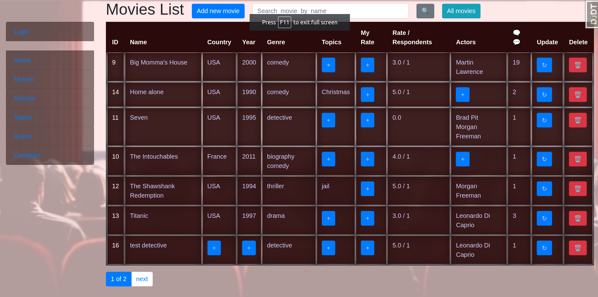

# Top movies

Simple movie diary ,
structured by country , genre, topic, actor,
with ratings and comments

## Check  it  out !

[Top  movies  project  deployed  to Render](https://top_movies.render.com/)

## installation

Python3 must be already installed

```shell
git clone https://github.com/M4Xpy/top_movies
cd top_movies
python3 -m venv venv
source venv/bin/activate
pip install requirements.txt
python manage.py runserver # starts Django project
```

## Features

* Authentication functionality for Customer/User
* Managing genres, topics, actors, movies, etc directly from website interface
* Admin panel for advanced managing

## Demo



